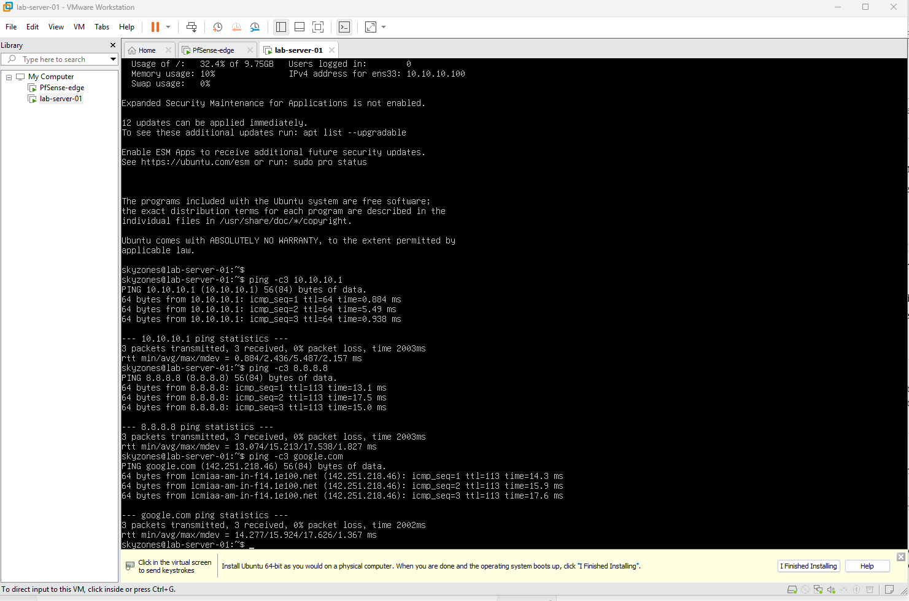
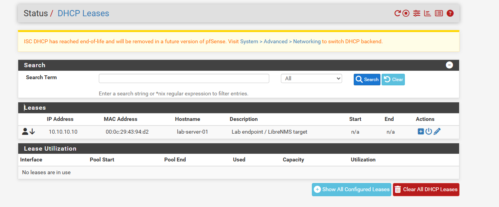
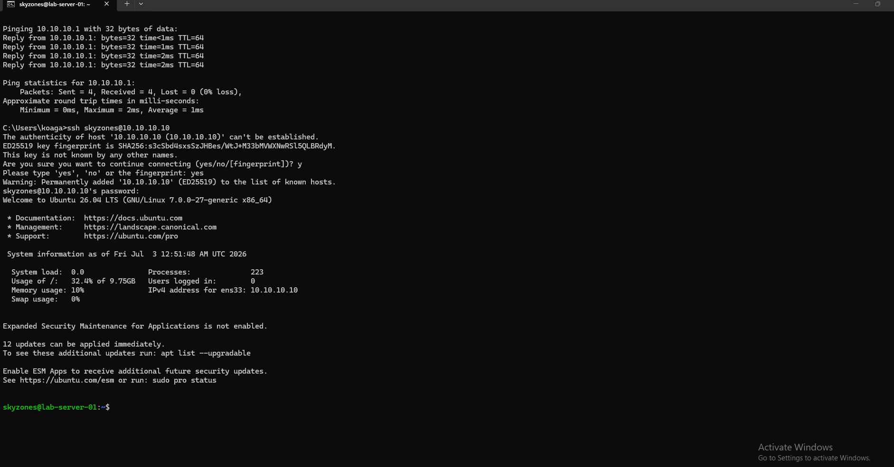
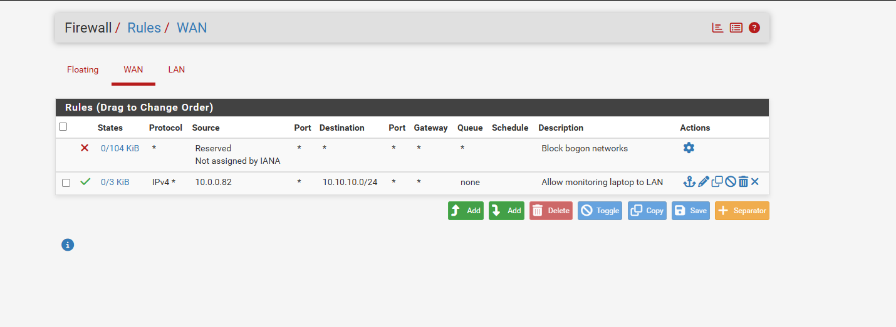
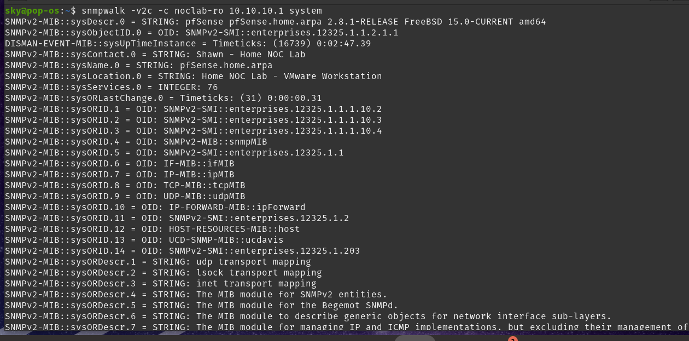
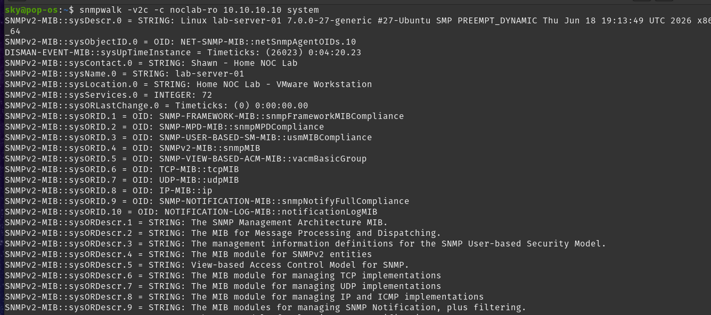
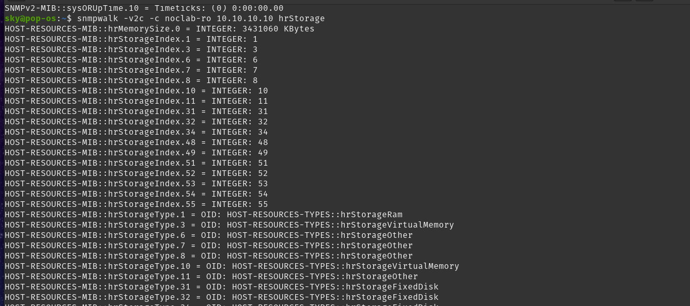

# Home NOC Monitoring Lab

A network operations monitoring environment built from scratch to demonstrate NOC analyst skills: network design, firewall configuration, device monitoring, alerting, troubleshooting, and documentation.

**Author:** Shawn Emmanuel · [LinkedIn](https://linkedin.com/in/shawn-emmanuel-940048340)

---

## Architecture

A segmented virtual network running under VMware Workstation Pro, monitored by a dedicated LibreNMS server on separate physical hardware — mirroring real NOC design, where the monitoring platform survives failures in the network it watches.

| Component | Role | Address |
|---|---|---|
| pfSense CE 2.8.1 | Edge firewall / router (WAN, LAN, DMZ) | WAN `10.0.0.50` · LAN `10.10.10.1/24` |
| lab-server-01 (Ubuntu Server) | Monitored LAN endpoint | `10.10.10.10` (DHCP static mapping) |
| Windows host | VMware Workstation host, VMnet adapter | `10.10.10.5` |
| Pop!_OS laptop | Dedicated monitoring server (LibreNMS) | `10.0.0.82` — home LAN, routed into lab via pfSense |
| DMZ segment | Reserved for segmentation phase | `10.10.20.0/24` (planned) |

**Stack:** pfSense · Ubuntu Server · LibreNMS · SNMP · syslog · NetFlow · VMware Workstation Pro

### Monitoring path

The monitoring server deliberately sits on a **different subnet** from the devices it polls, reaching them across the firewall rather than sharing a segment with them:

```
Home LAN 10.0.0.0/24                    Lab LAN 10.10.10.0/24
┌──────────────────┐                    ┌──────────────────────┐
│ Pop!_OS poller   │   static route     │ pfSense LAN .1       │
│ 10.0.0.82        │ ──10.10.10.0/24──▶ │ Windows host .5      │
└──────────────────┘   via 10.0.0.50    │ lab-server-01 .10    │
                          │             └──────────────────────┘
                          ▼
                  pfSense WAN 10.0.0.50
                  (bridged; WAN rules govern
                   inbound polling traffic)
```

This mirrors production monitoring topology, where the NMS lives in a management network and reaches monitored devices through explicit firewall policy. Traffic is **routed, not translated** — no port forwarding or NAT rules are involved, and pf's stateful engine handles return traffic.

---

## Progress

- [x] **Phase 1 — Network foundation:** pfSense installed and configured; WAN/LAN/DMZ segmentation; DHCP; management access — [build log](docs/01-network-foundation-buildlog.md)
- [x] **Phase 2a — Endpoint deployment:** Ubuntu server on the LAN; DHCP static mapping; routing/NAT verified; remote SSH management
- [x] **Phase 2b — Monitoring connectivity:** static WAN, cross-subnet routing, and firewall policy connecting the monitoring server to the lab segment
- [ ] **Phase 2c — SNMP + LibreNMS:** SNMP agents configured and verified on both targets *(in progress — LibreNMS deployment next)*
- [ ] **Phase 3 — Dashboards & visualization**
- [ ] **Phase 4 — Alerting** (device-down, interface, CPU, bandwidth rules with notifications)
- [ ] **Phase 5 — Centralized syslog & NetFlow**
- [ ] **Phase 6 — Simulated incidents & runbooks** (outage, saturation, flap)
- [ ] **Phase 7 — DMZ policy enforcement & Cisco device monitoring (GNS3)**

---

## Verified so far

**Endpoint routing through the firewall** — gateway, internet (NAT), and DNS from the LAN endpoint:



**Address reservation** — DHCP static mapping pinning the endpoint for reliable monitoring:



**Remote management** — SSH from the host, across the lab segment:



**Cross-subnet firewall policy** — WAN rule permitting the monitoring server into the lab segment. Reaching monitored devices required a static route on the poller, disabling pfSense's "block private networks" filter on WAN, and an explicit pass rule:



**SNMP polling — pfSense** — full symbolic walk from the monitoring server, across the firewall boundary:



**SNMP polling — Ubuntu endpoint** — agent bound beyond localhost, community source-restricted to the poller:



**Polling scope verified** — `hrStorage` returning host resource data confirms the agent's default view restriction was correctly removed, so CPU, memory, and disk metrics will be available to LibreNMS rather than interfaces alone:



---

## Troubleshooting log (selected)

Real problems I encountered and resolved during the build — full detail in the phase build logs:

- **Host couldn't reach the firewall GUI (timeout):** traced to a subnet mismatch — the hypervisor's host-only adapter sat on a different network than the firewall's LAN, leaving the host with an APIPA address. Resolved by statically addressing the host adapter into the lab subnet.
- **DHCP-to-static WAN conversion blocked:** pfSense's system-managed DHCP gateway could not be deleted or replaced while the interface still referenced it. Resolved by releasing the interface from DHCP first (static, no gateway), then creating and attaching the new gateway object — a misunderstanding of how pfSense manages gateway objects, but worth noting.
- **SSH sessions hanging after authentication:** kernel logs on the endpoint revealed RCU CPU stalls — the VM was being starved of CPU time, so sshd could not complete session setup. Diagnosed via `ssh -v` (healthy handshake, silent post-auth) correlated with `rcu_preempt detected stalls` in the console.
- **Monitoring server unreachable from the lab segment:** the poller was on the home LAN, not the lab subnet — i.e. on the WAN side of the firewall. Resolved with a static route on the poller plus WAN-side firewall policy, after identifying that pfSense's "block private networks" rule was silently dropping all RFC1918-sourced inbound traffic. Kept as a design decision rather than flattening the network, since a routed management path reflects production topology.
- **`snmpwalk` failing instantly with an unknown-identifier error:** the immediate failure (rather than a timeout) indicated a local fault, not a network one — confirmed by querying the same subtree by numeric OID, which succeeded. Root cause was Debian/Ubuntu shipping the SNMP tools without MIB files and disabling MIB loading by default. **Failure timing is diagnostic: instant failure is local, slow failure is network.**
- **Unidentified host on the monitored segment:** an undocumented address responding on the lab subnet was identified without credentials or a port scan using two passive signals — TTL 128 (Windows default) and MAC OUI `00:50:56` (VMware), confirming it as the hypervisor host's virtual adapter.

---

## Why this project

Built to demonstrate the core loop of NOC work — **monitor, detect, triage, resolve, document** — on real (virtualized) infrastructure, targeting NOC Technician / Analyst roles. Each phase ends in verifiable checkpoints and is documented as a build log with evidence.
