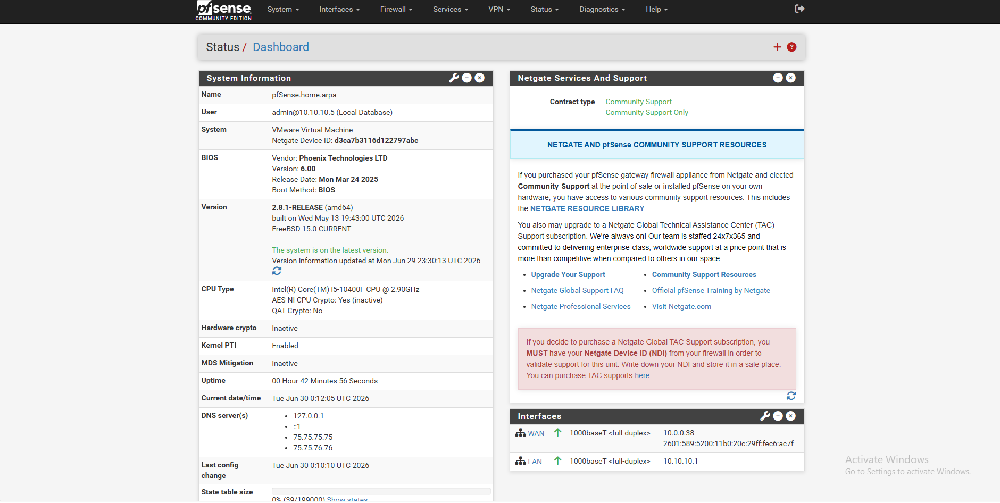

# home-noc-lab
Home NOC lab -  pfSense, LibreNMS, network monitoring &amp; alerting

# Home NOC Monitoring Lab

A network operations monitoring environment built from scratch to demonstrate
NOC analyst skills: device monitoring, alerting, troubleshooting, and documentation.

## Stack
- **Firewall/Router:** pfSense CE 2.8.1 (VMware Workstation Pro)
- **Monitoring:** LibreNMS (SNMP, syslog, NetFlow) — *in progress*
- **Segments:** WAN / LAN (10.10.10.0/24) / DMZ (10.10.20.0/24)

## Progress
- [x] Phase 1 — Network foundation & firewall ([build log](docs/01-network-foundation-buildlog.md))
- [ ] Phase 2 — Endpoints + monitoring server connectivity
- [ ] Phase 3 — Dashboards & alerting
- [ ] Phase 4 — Simulated incidents & runbooks

